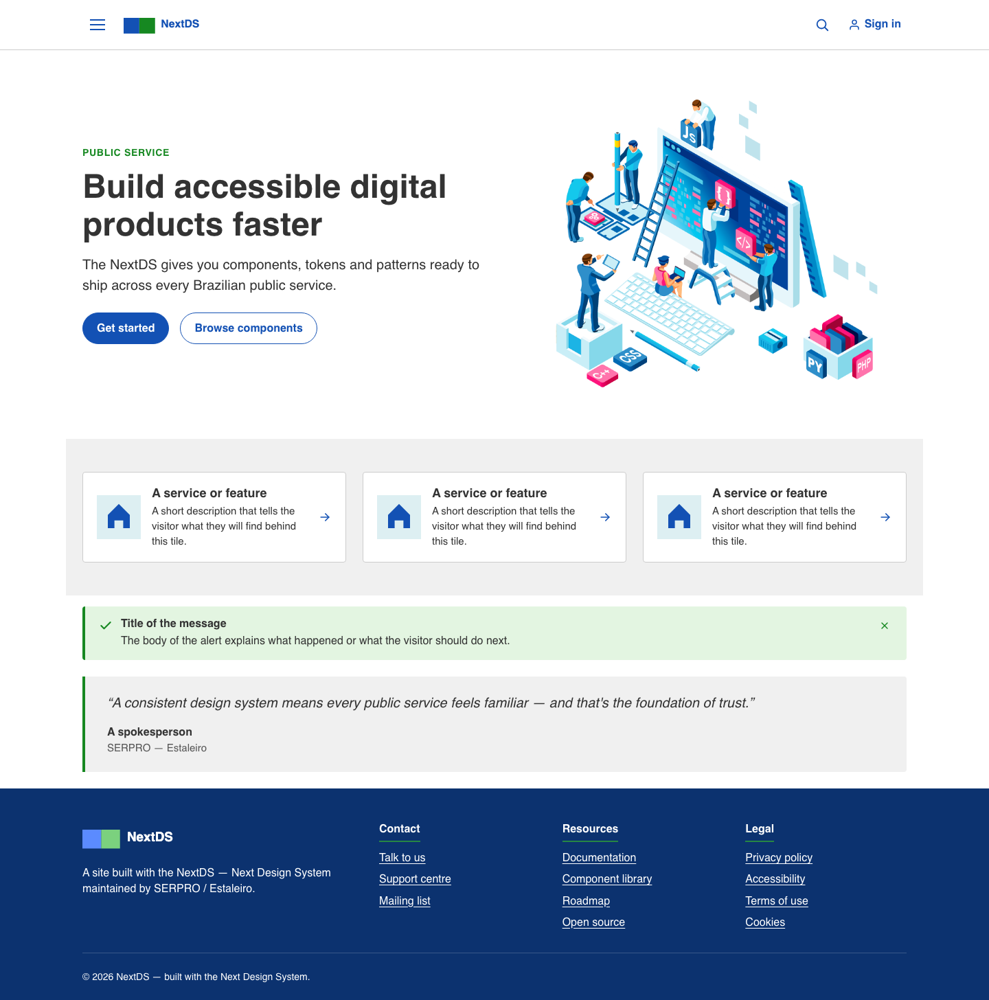
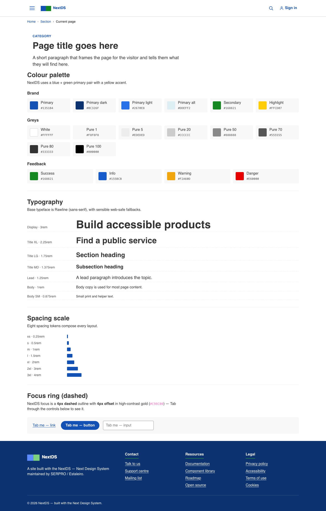
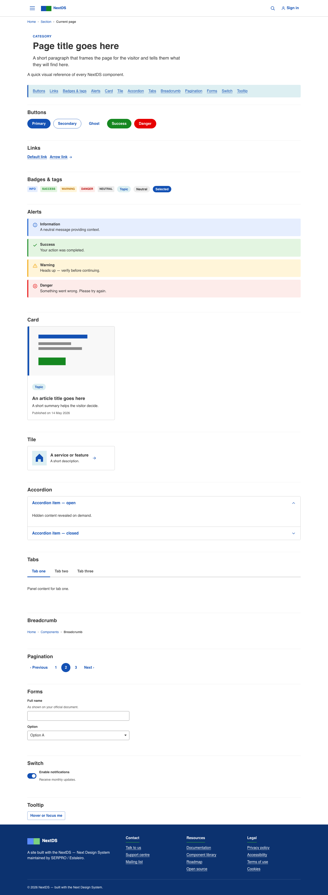

# NextDS — SERPRO / Estaleiro Next Design System for Liferay

A Liferay site initializer plus theme client extension that brings the
[Next Design System](https://next-ds.estaleiro.serpro.gov.br/) — the SERPRO
/ Estaleiro design system built on top of `gov.br/ds` — to Liferay DXP.
Use it as a starting point for Brazilian government sites and intranets on
Liferay.

It targets **Liferay 7.4.13 / dxp-2024.q4.0** (PATH A: OSGi site initializer
JAR + themeCSS client extension).

## Contents

```
NextDS/
├── settings.gradle                ← Liferay workspace plugin (Gradle)
├── gradle.properties              ← liferay.workspace.product=dxp-7.4.13.uXXX
├── build-scripts/
│   └── nextds-site-initializer/
│       ├── bnd.bnd                ← OSGi headers (Liferay-Site-Initializer-Name, Provide-Capability)
│       └── build.gradle
├── client-extensions/
│   └── nextds-theme/
│       ├── client-extension.yaml  ← type: themeCSS
│       ├── frontend-token-definition.json
│       ├── src/index.css          ← Layer 1 (primitives) + Layer 2 (semantics) + Layer 3 (br.* aliases)
│       └── dist/nextds-theme.zip  ← packaged client extension
├── META-INF/
│   └── resources/thumbnail.png    ← shown in "Select Template" tile
├── scripts/
│   └── validate.sh                ← strict pre-deploy validator (run before any build)
├── site-initializer/              ← source of truth (copied 1:1 into the JAR)
│   ├── thumbnail.png
│   ├── fragments/group/nextds/    ← collection + every fragment
│   ├── layout-page-templates/master-pages/main/
│   ├── layout-set/public/         ← themeName "Classic", site-wide settings
│   ├── layouts/                   ← 1_home, components, styles
│   └── style-books/               ← nextds-default, nextds-dark
└── tokens.css                     ← OFFICIAL Next-DS / gov.br token catalogue (reference + embedded into theme)
```

## Screenshots

Full-page captures of the site as created by this site initializer on a Liferay DXP master bundle (October 2026), with the CSS theme client extension applied.

### Home



### Styles



### Components



## Quick start

Prerequisite: a running Liferay 7.4.13 / dxp-2024.q4.0 bundle.

```bash
# 1. Validate (refuse to build/deploy if it fails)
LIFERAY_VERSION=7.4.13 bash scripts/validate.sh .

# 2. Build the site initializer JAR (manual, reliable path)
cat > /tmp/nextds-manifest.mf <<'EOF'
Manifest-Version: 1.0
Bundle-ManifestVersion: 2
Bundle-Name: NextDS Site Initializer
Bundle-SymbolicName: com.nextds.site.initializer
Bundle-Version: 1.0.0
Liferay-Site-Initializer-Name: NextDS
Provide-Capability: liferay.site.initializer
Web-ContextPath: /site-initializer-nextds

EOF
jar cfm build-scripts/nextds-site-initializer/build/libs/com.nextds.site.initializer-1.0.0.jar \
  /tmp/nextds-manifest.mf site-initializer META-INF

# 3. Repackage the theme client extension (after editing src/index.css)
rm -rf /tmp/theme-pack && mkdir -p /tmp/theme-pack && cd /tmp/theme-pack && \
  unzip -q ../../client-extensions/nextds-theme/dist/nextds-theme.zip && \
  cp ../../client-extensions/nextds-theme/src/index.css static/index.css && \
  find . -name '.DS_Store' -delete && \
  rm -f ../../client-extensions/nextds-theme/dist/nextds-theme.zip && \
  zip -qr ../../client-extensions/nextds-theme/dist/nextds-theme.zip .

# 4. Drop both bundles into Liferay's deploy/
cp build-scripts/nextds-site-initializer/build/libs/com.nextds.site.initializer-1.0.0.jar  $LIFERAY_HOME/deploy/
cp client-extensions/nextds-theme/dist/nextds-theme.zip                                    $LIFERAY_HOME/deploy/

# 5. Create a new site from "NextDS" in Liferay → Sites → Add → Select Template
# 6. Site Settings → Look and Feel → CSS Client Extension → pick "NextDS Theme"
```

## Pages

- **Home** (`/home`) — default landing, full hero + content sections (page-definition
  imported from a working reference site, see `site-initializer/layouts/1_home/`).
- **Styles** (`/styles`) — token catalogue (colours, typography, spacing, focus, surfaces).
- **Components** (`/components`) — gallery of every fragment in the kit.

The home page uses the prefix `1_` so it shows first in the navigation tree.

## Master page

`Main` (auto-key `main`) — header (`nextds-site-header-dynamic`) + `DropZone` +
footer. `nextds-site-header-dynamic` embeds `<lfr-widget-nav>` so the menu reflects
the actual Liferay page tree. A static `nextds-site-header` variant is also
shipped for pages that need a hard-coded nav.

## Header pattern (icon-only menu + floating search overlay)

The header follows the Next-DS reference: hamburger icon (no visible "Menu"
text — only a Clay tooltip), brand on the centre-left, search-icon trigger
and account on the right.

- The **menu drawer** floats as an absolute-positioned overlay (`position:
  absolute; top: 100%; box-shadow: lg`) — it does NOT push page content down.
- The **search panel** also floats below the bar as a blue overlay. The
  trigger icon expands it; the close icon dismisses it. Pressing `Escape`
  or clicking outside the header also closes both menus.
- Tooltips on the icon buttons use Liferay's Clay attribute pattern:
  `data-title="Menu" data-tooltip-align="bottom"` — Clay's global initializer
  picks them up automatically.

## Tokens — three layers

The theme client extension ships a layered token architecture, all in one
`client-extensions/nextds-theme/src/index.css`:

1. **Layer 1 — Official Next-DS / gov.br primitives** (verbatim, ~1300+ tokens).
   Loaded directly from `tokens.css` (also kept in the repo root for reference).
   Includes the full colour scales (`--blue-warm-vivid-70`, `--gold-vivid-40`,
   `--color-primary-default`, `--color-secondary-01..09`, `--color-highlight`,
   `--danger`, …), spacing (`--spacing-scale-half`..`--spacing-scale-10xh`),
   typography (`--font-size-scale-*`, `--font-family-base: Rawline, Raleway, ...`),
   surface (`--surface-width-sm/md/lg`, `--surface-rounder-pill`), focus
   (`--focus-color: var(--gold-vivid-40)` = `#c2850c`, `--focus-style: dashed`,
   `--focus-width: 4px`).

2. **Layer 2 — Semantic aliases** consumed by every fragment (`--color-bg`,
   `--color-text`, `--color-link`, `--color-brand`, `--color-border`, `--space-s/m/l/xl`,
   `--nextds-max-width`, `--nextds-radius`, `--nextds-radius-pill`, …).

3. **Layer 3 — gov.br dot-notation aliases** (`--br-color-primary-default`,
   `--br-form-border-width-default`, `--br-focus-color`, `--br-spacing-half`, …) —
   present so downstream gov.br snippets paste in cleanly.

> Fragments must consume only Layer-2 (or Layer-3) tokens — never Layer-1
> primitives directly. The validator (`scripts/validate.sh`) fails the build
> on any direct primitive reference inside `site-initializer/fragments/**`.

## Focus styling

Next-DS uses a **dashed gold outline** for focus — distinct from the W3C-style
yellow background swap. Defined in `client-extensions/nextds-theme/src/index.css`:

- `--focus-color`  = `var(--gold-vivid-40)` = `#c2850c`
- `--focus-style`  = `dashed`
- `--focus-width`  = `var(--surface-width-lg)` = `4px`
- `--focus-offset` = `var(--spacing-scale-half)` = `4px`

Interactive controls (button, link, tab, input, summary, hamburger trigger)
get `outline: var(--focus-width) var(--focus-style) var(--focus-color);
outline-offset: var(--focus-offset);` — bigger and more contrasted than the
W3C default so it stays visible on every brand colour surface.

## Liferay 7.4.13 / 2024.Q4 gotchas

These bit us at least once during this project; the validator catches them
all but they're worth remembering:

- Fragment FreeMarker uses **bracket** syntax: `[#if]…[/#if]`. AntiSamy
  filters `<#if>` silently. Use multiple `[#if]` blocks instead of `[#elseif]`.
- Checkbox config fields: **no `dataType`**; `defaultValue` is the *string*
  `"true"`/`"false"`. Anything else and the field becomes inert.
- Style books use `"themeId": "classic_WAR_classictheme"` (literal). There is
  no themeId for a CX bundle symbolic name — `"nextds-theme"` is not a valid
  themeId.
- The site initializer thumbnail must live at **both** `site-initializer/thumbnail.png`
  (for the initializer engine) and `META-INF/resources/thumbnail.png` (for the
  *Select Template* tile).
- `fragment.json` references `"configurationPath": "configuration.json"` — not
  `index.json`. The Q4 client-extension flavour reverses this; do not mix them.
- Every `Row` page-element `definition` must include the boolean `"gutters"` —
  otherwise `RowLayoutStructureItemImporter` throws an NPE on `Map.get("gutters")`
  and site creation rolls back with a generic *"An unexpected error occurred"*.
- `page-definition.json` must **NOT** contain `"siteKey"` anywhere — the
  workspace plugin rejects it for 7.4.13.
- Locale keys use the underscore form: `"en_US"`, not `"en-US"`.

## Style Book preview workaround — duplicated utility classes

Liferay's Style Book → fragment preview iframe loads only the fragment's own
`index.css`. The theme client-extension stylesheet is **not** injected into
that preview, so a fragment that relies on theme-level helpers renders unstyled
in the editor preview.

To keep the preview readable, the affected fragments duplicate the small subset
of utility classes they need at the top of their own `index.css`, fenced by:

```css
/* === preview-workaround: duplicated from theme === */
.nextds-container { … }
.nextds-clean-list { … }
.nextds-sr-only { … }
/* === end preview-workaround === */
```

Remove the duplication once Liferay loads theme CSS into the Style Book preview
iframe. Until then, every new fragment that relies on theme utility classes
should duplicate the minimum it needs at the top of its `index.css` between the
preview-workaround markers.

## Common edits

### Add a new fragment

1. Create `site-initializer/fragments/group/nextds/fragments/nextds-<name>/`
   with `fragment.json`, `configuration.json`, `index.html`, `index.css`,
   `index.js`.
2. `fragment.json` shape:
   ```json
   {
     "configurationPath": "configuration.json",
     "cssPath": "index.css",
     "htmlPath": "index.html",
     "jsPath": "index.js",
     "name": "<Display name>",
     "type": "component"
   }
   ```
3. Use semantic tokens only (`var(--color-*)`, `var(--space-*)`, `var(--nextds-*)`).
4. If your fragment relies on theme utility classes, duplicate them at the top
   of `index.css` between the preview-workaround markers.
5. Run the validator: `LIFERAY_VERSION=7.4.13 bash scripts/validate.sh .`.

### Add a new page

1. Create `site-initializer/layouts/<key>/` with `page.json` and `page-definition.json`.
2. `page.json` keys: `externalReferenceCode`, `friendlyURL`, `hidden`,
   `name_i18n`, `private`, `system: false`, `type: "Content"`.
3. `page-definition.json` must include `"settings": {"masterPage": {"key": "main"}}`.
4. Every `Row` element must declare `"gutters": true|false`.
5. Re-run the validator.

### Import a page-definition from an existing site

When iterating on a site by hand, the headless-delivery API exports the
`pageDefinition` JSON for any page:

```bash
curl -u 'test@liferay.com:test' \
  "http://<host>/o/headless-delivery/v1.0/sites/<siteId>/site-pages/<friendlyUrl>?nestedFields=pageDefinition" \
  -o /tmp/page.json
```

Strip every `siteKey` inside `pageElement.*`, ensure every Row's `definition`
carries `"gutters": true`, drop the auto-generated UUID `id` fields, then drop
the result into `site-initializer/layouts/<key>/page-definition.json`.

## Deploy lifecycle

- **Site initializer changes apply to newly-created sites only.** Existing
  sites keep the fragments / pages that were copied at creation time. Delete
  and recreate the site to pick up structural changes (new fragments, new
  pages, fragment HTML/JS edits).
- **Theme client extension changes are live on bundle restart** and reflect
  immediately on every site that has the **NextDS Theme** CSS Client Extension
  selected under *Site Settings → Look and Feel*. Token tweaks, colour
  adjustments, focus tuning — anything in the theme CSS — can be hot-fixed
  this way without recreating the site.

## License

This kit packages and re-styles design tokens published by SERPRO / Estaleiro
under the [Next Design System](https://next-ds.estaleiro.serpro.gov.br/). The
Liferay glue (fragments, page definitions, build scripts) in this repository
is provided as-is for use as a starting point.
